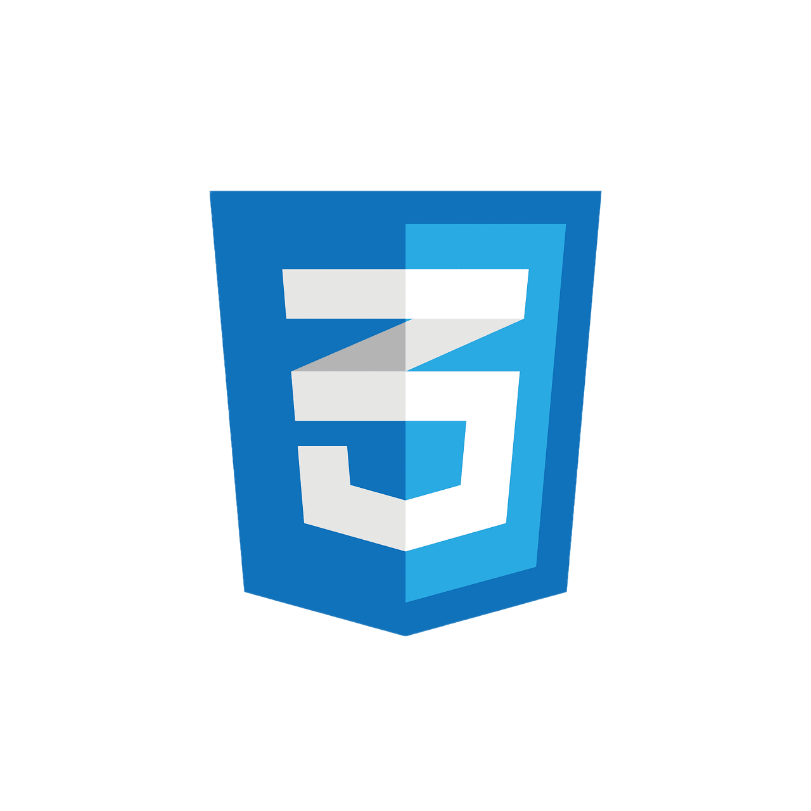
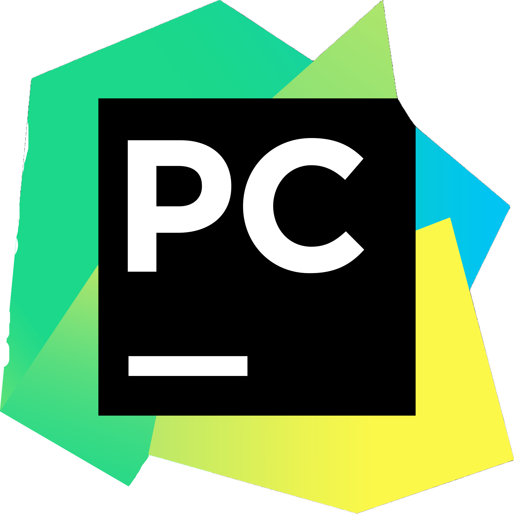
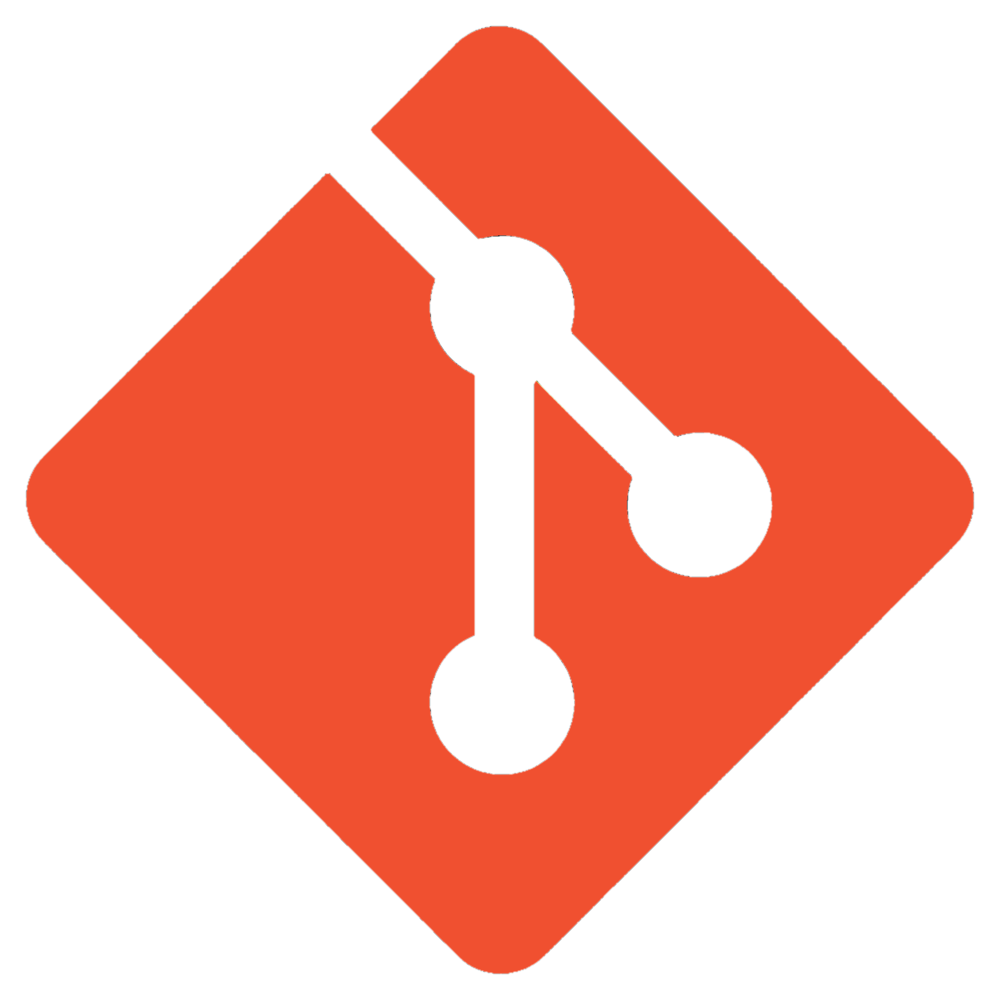

---

  

   

 
👋 Привет! Я Олег (aka Giggichk)

💻 Python-разработчик | Back-end разработчик | Создатель Telegram-ботов

Меня увлекает создание удобных и надежных решений на Python — от разработки backend-сервисов до автоматизации и написания Telegram-ботов. В своей работе уделяю внимание структуре кода, оптимизации и читаемости.

---

  <h1>Technology stack</h1>

  

  <h2>Back-end</h2>
    
    
    

  
  <h2>Front-end</h2>
  
  

  <h2>Tools</h2>
  
  
  

